# M-18-2D-ARRAY

- When its needed to take multiple array . we cants take at a time right? like each student's have 10 marks , one array for student will hold one student's marks , multiple student multiple array. this is when 2d Array is needed.

## what is 2d array?

A 2D array is like a table with rows and columns. It is an array of arrays, where each row can hold multiple values. For example, you can use a 2D array to store the marks of several students, where each row is a student and each column is a subject or test score. It helps organize data in a grid format, making it easy to access and manage.

- 2D array means like its an array , inside each field of the array we can store another array. remember the inside array will be of fixed size.

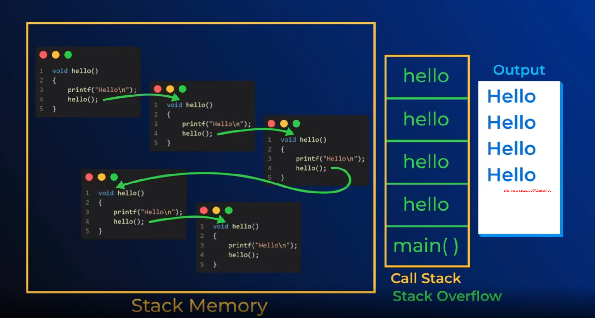

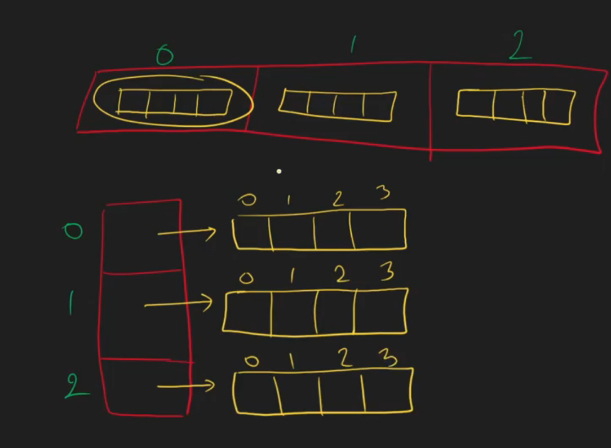

- suppose we c=want to change a value of the inside array we need to first tell which index of the first array then the inside array index

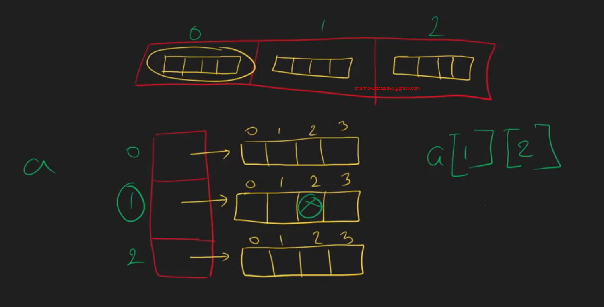

- final indexing pattern

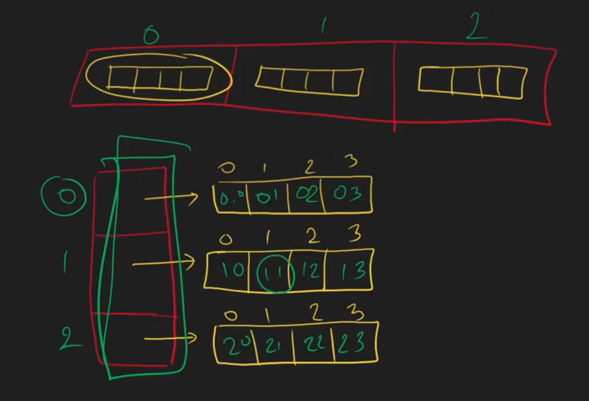

- suppose we need a 4 indexed array.

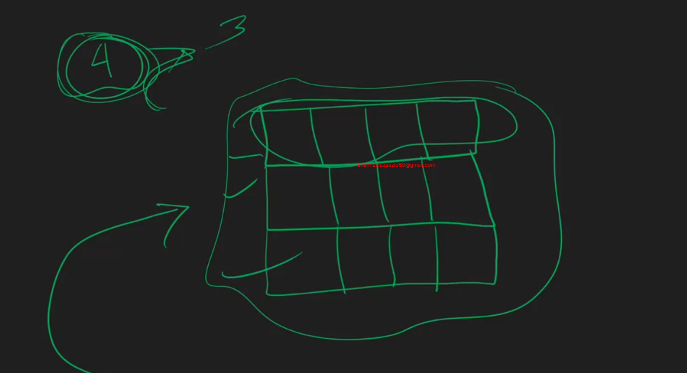

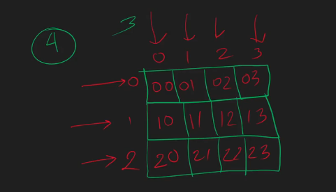

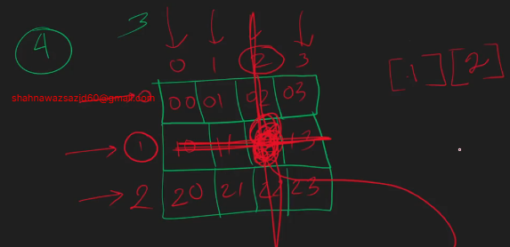

- lets replace this value

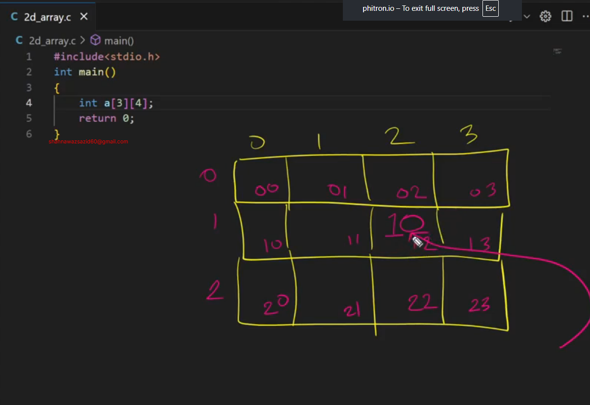

```c
#include <stdio.h>

int main()
{
    int a[3][4];
    a[1][2] = 10;
    printf("%d\n", a[1][2]);
    return 0;
}
```

- lets take input

- input of 2d array

```
2 3
1 2 3
4 5 6
```

- grabbing the input

```c
#include <stdio.h>

int main()
{
    int r, c;
    scanf("%d %d", &r, &c);
    int ar[r][c];
    for (int i = 0; i < r; i++)
    {
        for (int j = 0; j < c; j++)
        {
            scanf("%d", &ar[i][j]);
        }
    }
    // print
    for (int i = 0; i < r; i++)
    {
        for (int j = 0; j < c; j++)
        {
            printf("%d ", ar[i][j]);
        }
        printf("\n");
    }
    return 0;
}
```

- PRINT SPECIFIC ROW

```
3 4
1 2 3 2
4 5 6 3
7 8 9 2
1
```

```C
#include <stdio.h>

int main()
{
    int r, c;
    scanf("%d %d", &r, &c);
    int ar[r][c];
    for (int i = 0; i < r; i++)
    {
        for (int j = 0; j < c; j++)
        {
            scanf("%d", &ar[i][j]);
        }
    }
    // print specific row and column
    int specific_row;
    scanf("%d", &specific_row);
    for (int i = 0; i < c; i++)
    {
            printf("%d ", ar[specific_row][i]);
    }
    return 0;
}
```

- Print specific column

```
3 4
1 2 3 2
4 5 6 3
7 8 9 2
1

```

```c
#include <stdio.h>

int main()
{
    int r, c;
    scanf("%d %d", &r, &c);
    int ar[r][c];
    for (int i = 0; i < r; i++)
    {
        for (int j = 0; j < c; j++)
        {
            scanf("%d", &ar[i][j]);
        }
    }
    // print specific row and column
    int specific_col;
    scanf("%d", &specific_col);
    for (int i = 0; i < r; i++)
    {
            printf("%d ", ar[i][specific_col]);
    }
    return 0;
}
```

### Lets see some types of matrix

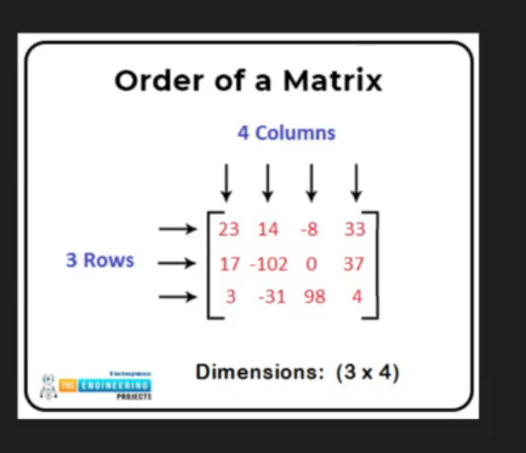

- 3/4 matrix

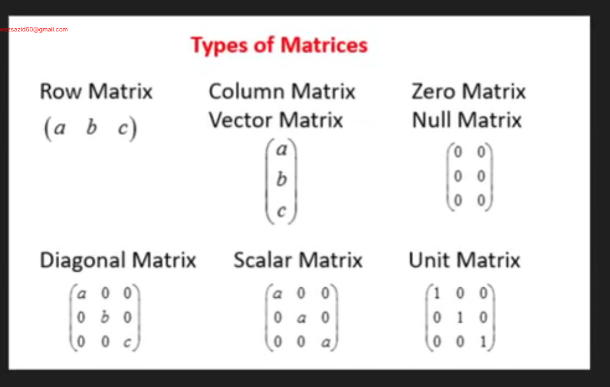

- CHECKING ROW MATRIX

```C
#include <stdio.h>

int main()
{
    int r, c;
    scanf("%d %d", &r, &c);
    int ar[r][c];
    for (int i = 0; i < r; i++)
    {
        for (int j = 0; j < c; j++)
        {
            scanf("%d", &ar[i][j]);
        }
    }
    if(r ==1){
        printf("This is a row matrix\n");
    }else{
        printf("This is not a row matrix\n");
    }
    return 0;
}
```

- checking square matrix

```c
#include <stdio.h>

int main()
{
    int r, c;
    scanf("%d %d", &r, &c);
    int ar[r][c];
    for (int i = 0; i < r; i++)
    {
        for (int j = 0; j < c; j++)
        {
            scanf("%d", &ar[i][j]);
        }
    }
    if(r ==c){
        printf("This is a square matrix\n");
    }else{
        printf("This is not a square matrix\n");
    }
    return 0;
}
```

- check if zero matrix or not

```c
#include <stdio.h>

int main()
{
    int r, c;
    scanf("%d %d", &r, &c);
    int ar[r][c];
    for (int i = 0; i < r; i++)
    {
        for (int j = 0; j < c; j++)
        {
            scanf("%d", &ar[i][j]);
        }
    }
    // check if it's a zero matrix
    int total_val = r * c;
    int zero_count = 0;

    for (int i = 0; i < r; i++)
    {
        for (int j = 0; j < c; j++)
        {
            if (ar[i][j] == 0)
            {
                zero_count++;
            }
        }
    }
    if (zero_count == total_val)
    {
        printf("This is a zero matrix\n");
    }
    else
    {
        printf("This is not a zero matrix\n");
    }
    return 0;
}

```

### Checking diagonal matrix

#### Primary Diagonal

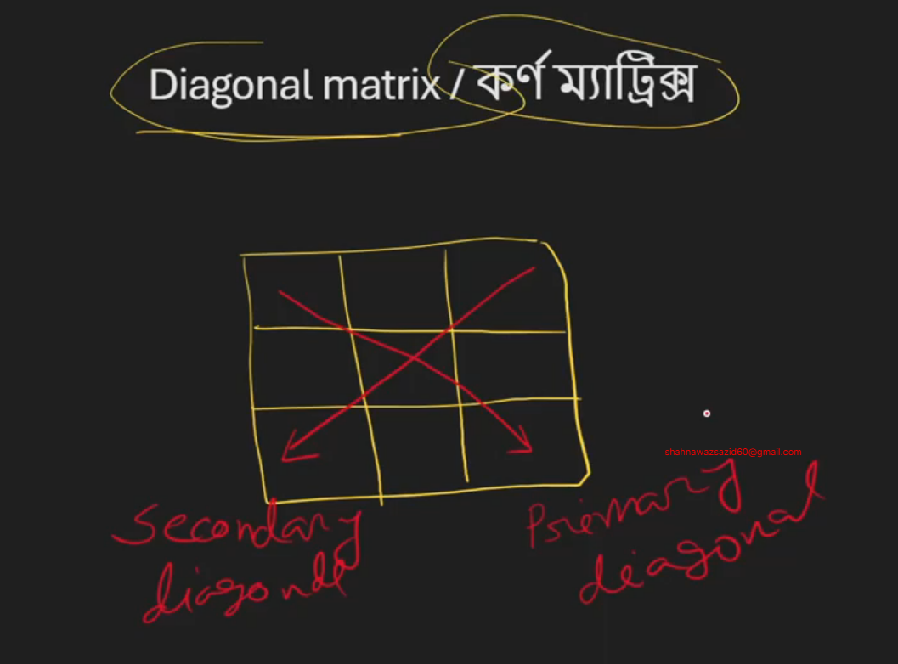

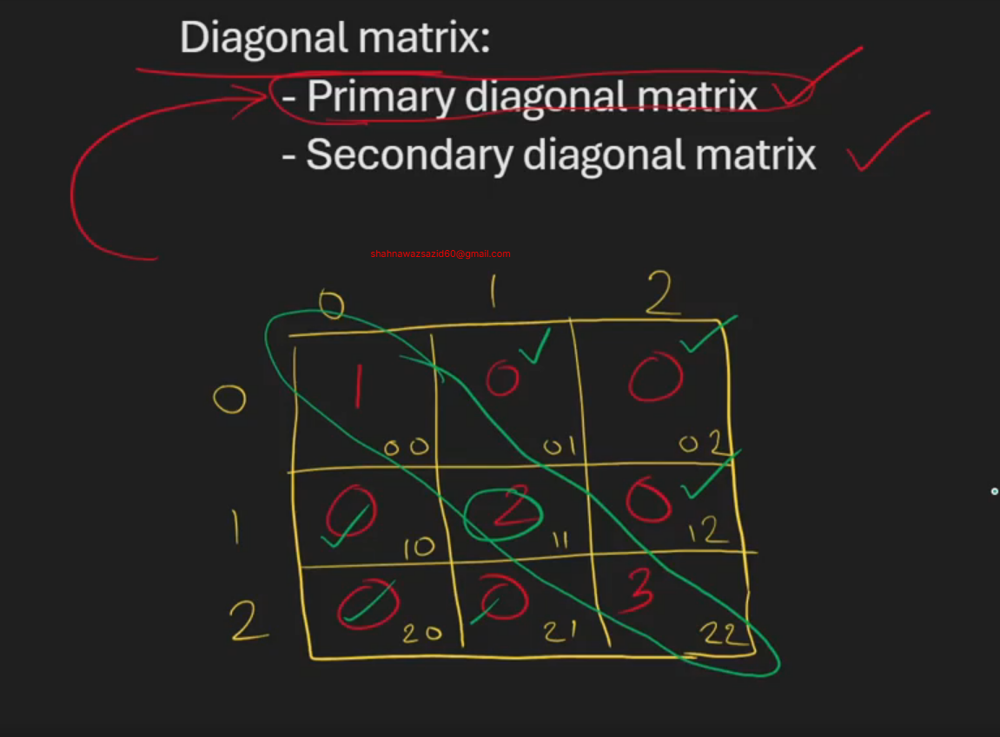

```
3 3
1 0 0
0 2 0
0 0 3
```

```c

#include <stdio.h>

int main()
{
    int r, c;
    scanf("%d %d", &r, &c);
    int ar[r][c];
    for (int i = 0; i < r; i++)
    {
        for (int j = 0; j < c; j++)
        {
            scanf("%d", &ar[i][j]);
        }
    }
    // flag variable
    int is_diagonal = 0;
    // check if it's a diagonal matrix
    if(r==c){ //

        for(int i = 0; i < r; i++)
        {
            for (int j = 0; j < c; j++)
            {
                if(i == j){
                    // inside diagonal
                }else{
                    // outside diagonal
                    if(ar[i][j] != 0){
                        // flag the matrix as not a diagonal matrix
                        is_diagonal = 1;
                        printf("This is not a primary diagonal matrix\n");
                    }
                }
            }
        }
        if(is_diagonal == 0){
            printf("This is a diagonal matrix\n");
        }
    }else{
        printf("This is not a diagonal matrix\n");
    }
    return 0;
}
```

#### Secondary Diagonal

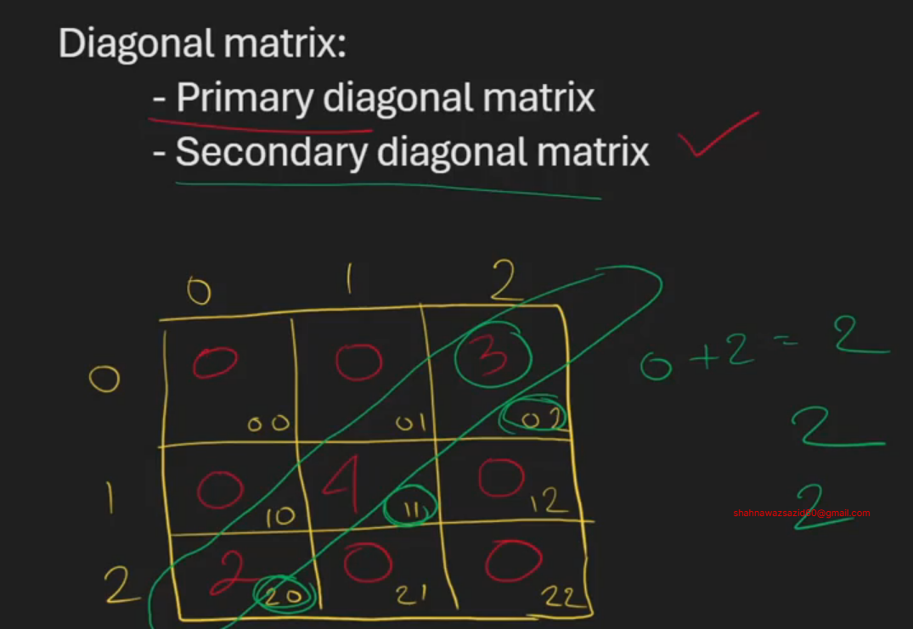

- the secondary diagonal finding formula is sum of the index values of secondary diagonals and which will be always `row - 1`

```c

                if(i+j == r-1){
                    // inside diagonal
                }
```

```
3 3 
0 0 1
0 2 0
2 0 0
```
```c
#include <stdio.h>

int main()
{
    int r, c;
    scanf("%d %d", &r, &c); 
    int ar[r][c];
    for (int i = 0; i < r; i++)
    {
        for (int j = 0; j < c; j++)
        {
            scanf("%d", &ar[i][j]);
        }
    }
    // flag variable 
    int is_diagonal = 0;
    // check if it's a diagonal matrix
    if(r==c){ // 
    
        for(int i = 0; i < r; i++)
        {
            for (int j = 0; j < c; j++)
            {
                if(i+j == r-1){
                    // inside diagonal
                }else{
                    // outside diagonal
                    if(ar[i][j] != 0){
                        // flag the matrix as not a diagonal matrix
                        is_diagonal = 1;
                        printf("This is not a secondary diagonal matrix\n");
                    }
                }
            }
        }
        if(is_diagonal == 0){
            printf("This is a secondary diagonal matrix\n");
        }
    }else{
        printf("This is not a secondary diagonal matrix\n");
    }
    return 0;
}
```